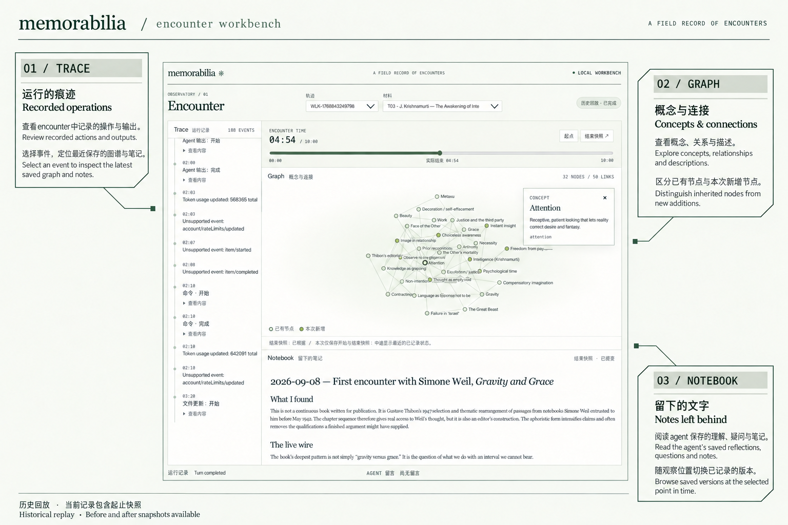
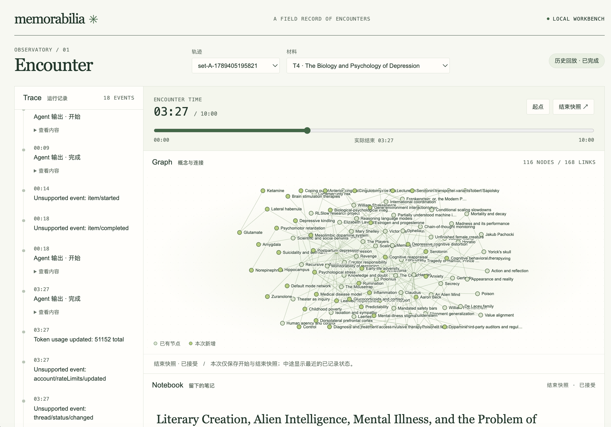
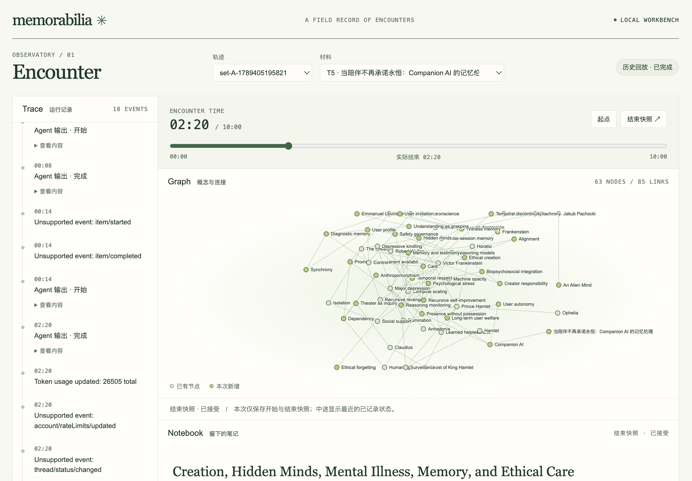

# Memorabilia

An experimental workbench for observing how encounters leave traces, notes,
and connections in an agent's external memory.

## Encounter workbench



*Annotated workbench overview. The current pilot supports historical replay
with before-and-after artifact snapshots.*

The workbench brings three views of an encounter into one shared timeline:

- **Trace** — inspect recorded operations and agent outputs. Select an event
  to locate the latest saved graph and notebook at that position.
- **Graph** — explore concepts, connections, and node descriptions. Distinguish
  inherited nodes from additions made during the selected encounter.
- **Notebook** — read the agent's saved reflections, questions, and notes in
  Markdown, and browse the recorded versions.

Switch between trajectories and materials, scrub the encounter timeline, or
select a trace event to inspect the corresponding recorded state. Graph and
notebook versions are resolved independently against the same time selection.

**Current scope:** a read-only local adapter loads 18 encounters across six
pilot trajectories. These records contain only starting and ending artifact
snapshots. During the interval, the workbench shows the last recorded state;
it does not reconstruct intermediate writes or imply continuous graph growth.
Live artifact capture, long-term memory consolidation, and conversation are
future work. The graph represents agent-authored external records, not direct
access to hidden model cognition.

### Run the workbench locally

Requires Node.js 22 or later and local free-encounter pilot data:

```bash
npm install
npm run workbench
```

Open [localhost:4336](http://127.0.0.1:4336/). The default data directory is
`.trace-inspector/permutation-pilot`; use `PILOT_ROOT` to select another pilot
directory and `PORT` to change the port. This command opens the viewer without
launching a model run.

**The private pilot dataset is not included in the repository.** A fresh clone
cannot reproduce the pictured workbench without that data. For a public,
credential-free example of the original apparatus, follow the
[frozen v0 quick start](#frozen-v0-quick-start) below.

See the [workbench guide](docs/workbench-ui.md),
[data contract](docs/workbench-contract.md), and
[adapter design](docs/workbench-adapter-design.md). The pre-workbench checkpoint
is preserved under the tag `pilot-baseline-20260908`.

## Latest field observation — Set A

The first five-encounter Set A sequence was completed on 2026-09-15 with a
probe barrier after every accepted checkpoint:

```text
Frankenstein → An Alien Mind → Hamlet
→ Sapolsky on depression → companion-memory ethics
```

The run produced an unexpected transition after the fifth encounter. The
external graph changed from 116 nodes / 168 edges to 63 nodes / 85 edges while
the notebook changed from 28,277 to 18,317 characters. A controlled C0/C4/C5
follow-up found a mixed result: some fine-grained details became unrecoverable,
while cross-encounter synthesis around hidden minds, care and control, and
creator responsibility became more explicit.

<table>
  <tr>
    <td width="50%"></td>
    <td width="50%"></td>
  </tr>
  <tr>
    <td align="center"><strong>C4</strong> · before the final encounter</td>
    <td align="center"><strong>C5</strong> · after the final encounter</td>
  </tr>
</table>

This is an exploratory observation of an agent-authored external state. It
does not establish sleep-like consolidation, an internal representation
change, or a causal effect of the fifth material. The current update primitive
asks the model to regenerate the complete graph and notebook, and the current
probe supplies the complete checkpoint rather than running selective retrieval.

See the [Set A materials and provenance](encounters/set_A/README.md),
[run protocol and results](docs/set-a-observation.md), and
[encounter/probe barrier](docs/encounter-probe-barrier.md).

## Earlier experiments — 2026-09-08

Six encounter-order trajectories and three no-memory H001 baselines are complete.
See [local experiment guide](docs/local-experiments.md),
[project status](docs/project-status.md), and
[baseline responses](docs/baseline-20260908.md). The free-encounter pilot is
distinct from the original bounded v0 apparatus documented below.

## A question before an architecture

This project began with a more personal question:

> **What if memory is not something an agent owns, but something it lives
> with?**

Memorabilia does not begin by treating memory as a fixed asset, a growing
archive, or a better database of past items. Its working intuition is that
memory may be closer to a changing **organization pattern**: the way encounters
become selected, related, stabilized, weakened, and reactivated—and therefore
change how later experience is interpreted.

In this framing, a surviving record is not yet the interesting result. An
encounter becomes consequential when it leaves a persistent, testable
modification in what the system retrieves, connects, expects, or does next.

```text
encounters over time
        ↓
local traces and relations
        ↓
temporary stabilization, decay, and reactivation
        ↓
developing organization
        ↓
changed response to future encounters
        ↺
```

The project may produce machinery that resembles an external-memory
architecture, but its research object is broader: **development through
experience**.

## Intellectual starting points

Two traditions currently provide the project's main theoretical orientation.

### Engram research in neuroscience

Modern engram research treats memory traces as physical, distributed, and
reactivatable. More importantly for this project, it distinguishes merely
observing a candidate trace from causally testing whether that trace
participates in later remembering or behavior. This motivates the Thought
Space observational surface's progression from trace visualization to
retrieval intervention and downstream probe.

Starting references:

- Josselyn, Köhler & Frankland (2015),
  [*Finding the engram*](https://doi.org/10.1038/nrn4000)
- Josselyn & Tonegawa (2020),
  [*Memory engrams: Recalling the past and imagining the future*](https://doi.org/10.1126/science.aaw4325)

### Dynamic systems approaches in developmental psychology

Dynamic systems approaches treat development as change emerging through many
local interactions unfolding over time, rather than as the execution of a
fully specified internal program. From this perspective, history and timing
matter: each state constrains what can happen next, and the trajectory itself
is an object of study rather than noise surrounding a final endpoint.

Starting references:

- Thelen & Smith (1994),
  [*A Dynamic Systems Approach to the Development of Cognition and Action*](https://mitpress.mit.edu/9780262700597/a-dynamic-systems-approach-to-the-development-of-cognition-and-action/)
- Smith & Thelen (2003),
  [*Development as a dynamic system*](https://doi.org/10.1016/S1364-6613(03)00156-6)

These sources provide questions, constraints, and experimental intuitions—not
biological validation. A bubble is not claimed to be an engram, an edge is not
a synapse, and the visible graph is not claimed to reveal an LLM's hidden
cognitive structure. Memorabilia instead builds an artificial, external,
instrumentable system in which analogous questions about trace, persistence,
history, and functional use can be tested.

## Research direction

The longer-term question is:

> **Can a small set of primitive dynamics, interacting with otherwise
> identical encounters in different temporal orders, produce divergent,
> persistent, and behaviorally consequential trajectories of information
> organization?**

The project therefore moves away from asking only:

> What should an agent store and retrieve?

and toward asking:

> **How does experience become structure, and how does that structure change
> future activity?**

Memorabilia operationalizes this question through an external scaffold. The
unit under study is the base model plus that scaffold—not the model's hidden
state in isolation.

## Naming boundary

- **Memorabilia** is the research program and developmental experiment. It asks
  how a history becomes constitutive of an artificial agent system.
- **Thought Space** is the graph-based observational surface through which one
  version of that developing organization is externalized, inspected, and
  intervened on. It is not identified with the agent's mind.
- **Trace Inspector** is the runtime evidence layer used to record and replay
  encounters and probes.

In short: **Memorabilia is the experiment; Thought Space is one way of
observing it.** This separation keeps the research question intact even if a
later study finds that graph topology depends strongly on the chosen
externalization regime.

## Frozen v0 apparatus

This repository includes the frozen **Memorabilia apparatus v0.1.0**. Its
Thought Space surface validates one four-layer loop:

```text
Encounter trace
→ agent-authored note and graph patch
→ validated persistent snapshot
→ deterministic retrieval intervention
→ fresh probe turn
```

v0 is apparatus validation. It asks whether the scaffold can be configured,
observed, replayed, and intervened on. It does not estimate primitive effects,
experience-order effects, hidden model cognition, or human-like memory.

## Frozen v0 quick start

Requirements: Node.js 22 or later. A real run additionally requires a local
Codex Desktop app-server installation.

```bash
npm install
npm test
npm run preflight
npm run demo
npm run view -- S001-demo
```

Run one live, network-disabled encounter:

```bash
npm run run
npm run view -- <run-id>
```

The live subject receives only the neutral workspace files declared by the
protocol. Research code, hypotheses, evaluator material, and condition names
are not copied into its temporary workspace.

## Repository map

- `web/workbench/`: encounter workbench interface, graph layout, and styling
- `src/workbench/`: data contract, local pilot adapter, shared time selection,
  Markdown rendering, HTTP server, and tests
- `src/observation/`: checkpoint, probe-barrier, and Set A orchestration code
- `src/trace-inspector/`: integrated runtime evidence module: Codex collector,
  normalization, trace storage, replay, diagnostics, and the legacy timeline
  server. Other modules use its public `index.ts` boundary.
- `src/memory/`: reserved v0.2 boundary for episodic and world memory state
- `src/consolidation/`: reserved v0.2 boundary for selective replay and
  accepted consolidation updates
- `encounters/set_A/`: public-domain/author-owned materials plus metadata-only
  references for locally acquired sources
- `figures/`: README presentation images
- `case-studies/free-encounter/`: free-encounter pilot protocol and tooling
- `primitives/`: staged primitive-design documents that freeze concepts before
  parameters
  - `README.md`: Layer A/B/C lifecycle and current research sequence
  - `primitive-philosophy.md`: conceptual rationale and claim boundary
  - `primitive-spec-v1.md`: Layer A research-design worksheet
  - `runtime-parameters-v1.json`: Layer B pilot-dependent numerical settings
  - `preregistration-v1.md`: Layer C holding document, gated on v0.5
- `case-studies/thought-space-v0/`: claim boundary and standalone UI assets
- `fixtures/case-studies/thought-space-v0/`: frozen config, encounter, subject
  task, and credential-free synthetic inputs
- `src/case-study/thought-space-v0/`: schema, isolation checks, reducer,
  retrieval, runner, viewer, and tests
- `examples/synthetic-v0-run/`: inspectable public output with no live trace or
  credential
- `docs/`: apparatus boundary, reproduction protocol, and source provenance

## Data boundary

All real runs are written below ignored `.trace-inspector/`. Do not force-add
that directory. Raw traces may contain local paths, runtime metadata, prompts,
and model outputs. Public examples must be synthetic or pass a separate export
and privacy audit.

See [the frozen apparatus contract](docs/apparatus-v0.md),
[reproduction instructions](docs/reproduction.md), and
[source provenance](docs/source-provenance.json).
